# Spotify Sonic Explorer — Tarea 3: Multidimensional Data Visualization

DS5343 · Visualización de Datos · UTEC · 2026-2

Pipeline base (**Flask** + **D3.js v7**) para explorar 170,653 pistas de Spotify
(1921–2020) mediante 4 técnicas de visualización multidimensional obligatorias:
**RadViz**, **Star Coordinates**, **Parallel Coordinates** y **proyección PCA/t-SNE**.

**Estado:** el backend (EDA, limpieza, API Flask con filtrado/PCA/t-SNE/centroides)
está completo y funcional. El frontend es un esqueleto — cada vista (`app/static/js/*.js`)
tiene la estructura, el contrato con la API y un comentario `TODO` explicando qué
dibujar, pero el dibujo en D3 de las 4 técnicas queda por implementar.

---

## 1. Cómo correrlo

```bash
pip install -r requirements.txt
python app/app.py
# abrir http://127.0.0.1:5000
```

El dataset ya viene procesado en `data/processed/` (generado por `eda/eda_report.py`).
Si se quiere regenerar desde cero:

```bash
unzip "archive (9).zip" -d data/raw
python eda/eda_report.py    # corre el EDA completo y regenera data/processed/
```

---

## 2. Los datos

`archive (9).zip` (Kaggle "Spotify Dataset 1921-2020, 160k+ Tracks") contiene 5 CSV:

| Archivo | Filas | Grano |
|---|---|---|
| `data.csv` | 170,653 | 1 fila = 1 pista |
| `data_by_artist.csv` | 28,680 | agregado por artista |
| `data_by_genres.csv` | 2,973 | agregado por género |
| `data_by_year.csv` | 100 | agregado por año (1921–2020) |
| `data_w_genres.csv` | 28,680 | artista → lista de géneros |

`data.csv` es la tabla base. Las otras cuatro se usan para **enriquecer** (género por
artista → por pista) y para validar/agregar.

---

## 3. EDA exhaustivo — proceso y hallazgos

El análisis tabular completo (12 secciones — nulos, duplicados, outliers,
correlaciones, limpieza) se resume abajo; se generó con `eda/eda_report.py`
(script local, no versionado) y sus hallazgos alimentan tanto este README como el
notebook visual: [`eda/eda_notebook.ipynb`](eda/eda_notebook.ipynb) → figuras en
[`eda/figures/`](eda/figures/) (histogramas, boxplots, heatmap, barplots, series de
tiempo). Los plots de esta sección vienen de ese notebook.

### 3.1 Calidad de datos

- **Nulos clásicos (NaN): 0 en las 5 tablas.** Pero eso no significa que no haya
  datos faltantes: `data_w_genres.csv` tiene **34.4% de artistas con `genres == "[]"`**
  (lista vacía, no NaN) — es decir, casi 1 de cada 3 artistas no tiene género
  catalogado en Spotify. Este es el hallazgo de "missingness" más importante del
  dataset y se documenta explícitamente en vez de imputarse silenciosamente.
- **Duplicados exactos por `id`: 0.** Pero hay **4,454 duplicados lógicos**
  (mismo `name` + `artists` + `duration_ms`, `id` distinto) — típicamente
  remasters/re-releases del mismo tema (ej. `"40" - Remastered 2008` de U2 aparece
  2 veces). Se documentan pero **no se eliminan**: son observaciones válidas
  (ediciones distintas con distinta popularidad/fecha), eliminarlas perdería señal.
- **`release_date` viene en 3 formatos inconsistentes** (`YYYY`, `YYYY-MM`,
  `YYYY-MM-DD` — 50,855 / 1,610 / 118,188 filas respectivamente). Se normaliza con
  `pd.to_datetime(..., format="mixed")`; la columna `year` ya provista es
  consistente al 100% con esto, así que se usa `year` como fuente de verdad temporal.
- **`artists` es un string con forma de lista Python** (`"['A', 'B']"`), no una
  lista real ni una columna separada. Se parsea con `ast.literal_eval`. **20.2% de
  las pistas son colaboraciones** (>1 artista), hasta 40 artistas en una sola pista.

<p align="center">
  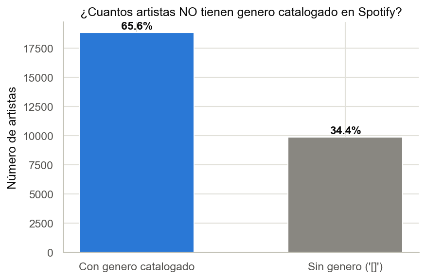
  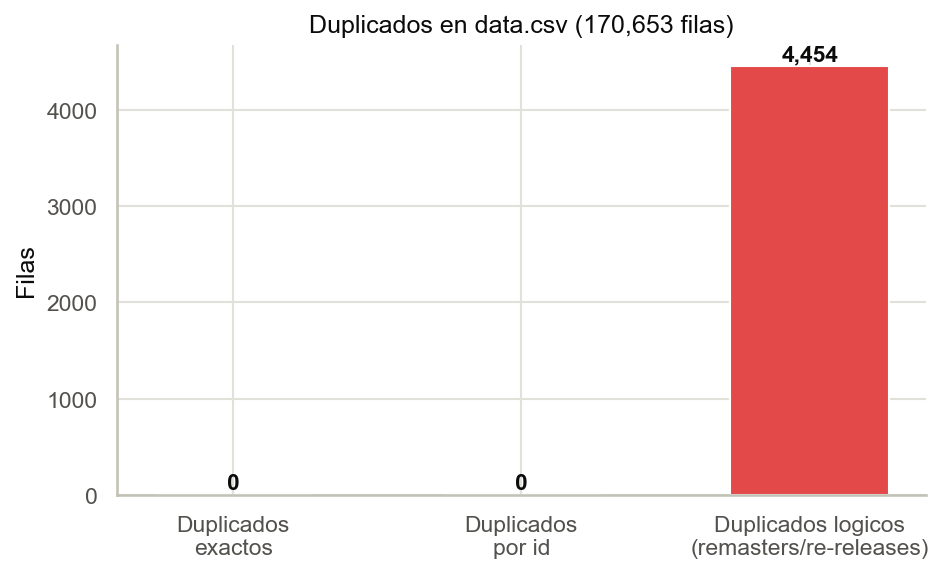
</p>
<p align="center">
  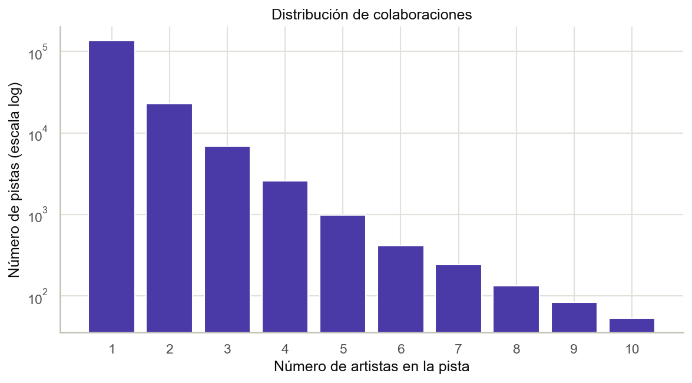
  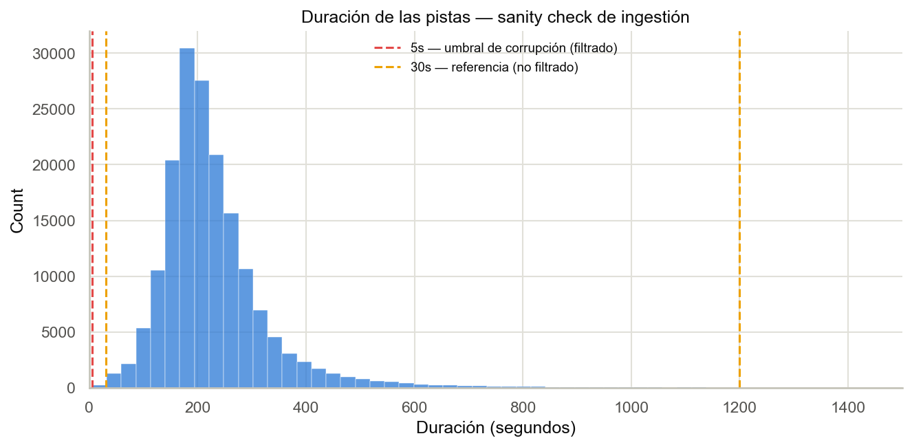
</p>

### 3.2 Escalas — crítico para RadViz / Star Coordinates / Parallel Coordinates

Los 3 técnicas mandatorias son **extremadamente sensibles a escala**: un eje con
rango más grande domina visualmente aunque no sea más "importante". Se midió el
rango de cada feature:

| Feature | Rango | Tratamiento |
|---|---|---|
| valence, acousticness, danceability, energy, instrumentalness, liveness, speechiness | `[0, 1]` | ya comparables |
| `loudness` | `[-60, 3.9]` dB | requiere normalización + tiene signo |
| `tempo` | `[0, 243.5]` BPM | requiere normalización |
| `duration_ms` | `[5,108, 5,403,500]` ms | 3 órdenes de magnitud — requiere normalización |
| `popularity` | `[0, 100]` | escala propia de Spotify, no es un audio feature "puro" |

**Decisión:** se generan columnas `*_norm` (min-max sobre el dataset completo, no
sobre la muestra) para las 11 features continuas. RadViz, Star Coordinates y
Parallel Coordinates consumen **exclusivamente** las columnas `_norm`.

<p align="center">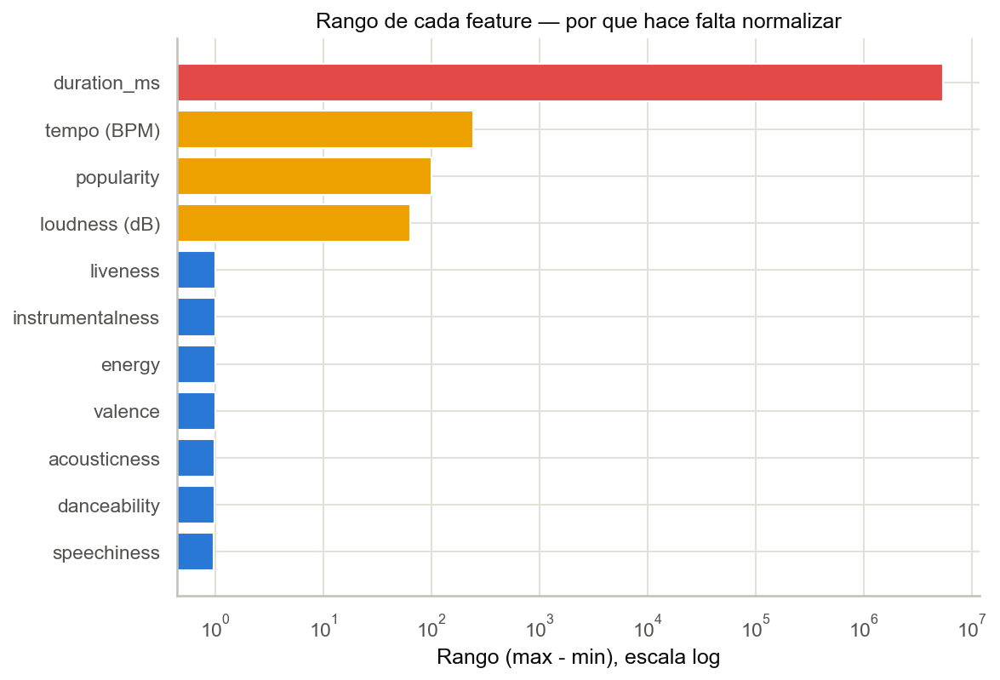</p>

### 3.3 Outliers — por qué IQR clásico no basta

Se corrieron dos métodos (IQR 1.5× y z-score > 3) sobre las 11 features continuas
(tabla completa en el reporte). Conclusión explícita: **no se eliminó ningún
outlier automáticamente**, porque en este dataset casi todos son señal, no ruido:

- `instrumentalness`, `speechiness`, `liveness` tienen distribuciones **bimodales /
  cola larga en 0** (la mayoría de canciones tiene voz → `instrumentalness≈0`; el
  IQR marca "outlier" al 21% de las filas — es la forma natural del feature, no un
  error).
- `loudness` bajo (< -35dB) correlaciona con **grabaciones de 1920s-1940s** (baja
  fidelidad de la época), no con ruido aleatorio — confirmado cruzando con `year`.
- `duration_ms` alto son interludios/clásica/spoken word — legítimos. Se aplicó
  únicamente un **sanity check de ingestión** (no un filtro estadístico): pistas
  con `duration_ms < 5000` (< 5s, probable corrupción) se descartan en la limpieza
  final (0 filas afectadas en este dataset — se documenta la regla igual, por si el
  dataset cambia).
- `popularity == 0` afecta al **16.3%** de las pistas — no es un outlier estadístico
  (está en rango válido) pero sí un caso de negocio a tratar aparte (ver 3.5).

<p align="center">
  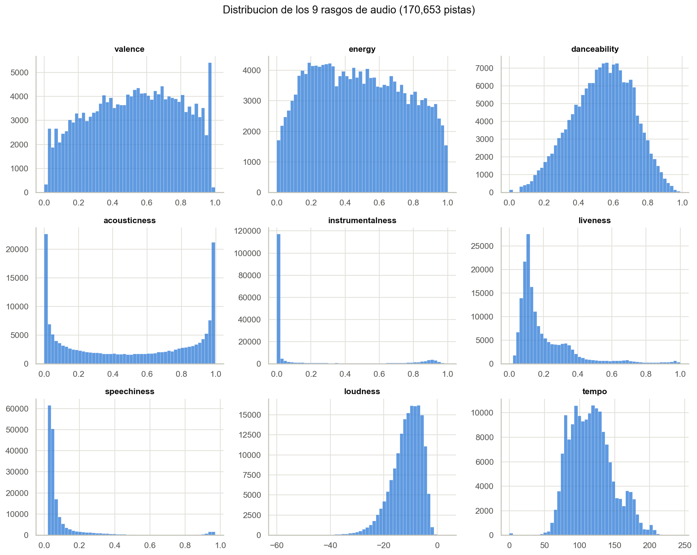
</p>
<p align="center">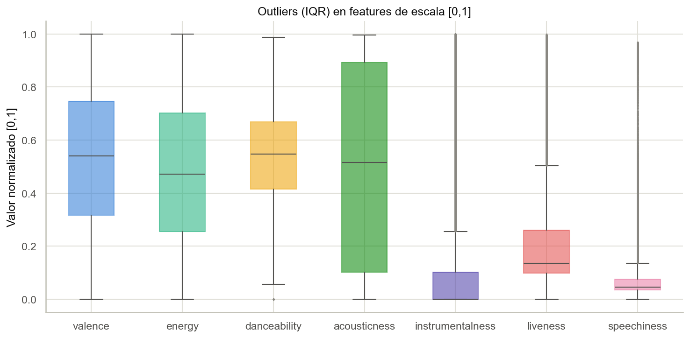</p>

### 3.4 Correlaciones (relevante para elegir ejes / evitar redundancia visual)

Pares con `|r| > 0.4` (dataset completo):

```
popularity ~ year            0.86   energy ~ loudness         0.78
acousticness ~ energy       -0.75   acousticness ~ year       -0.61
acousticness ~ popularity   -0.57   acousticness ~ loudness   -0.56
valence ~ danceability       0.56   energy ~ year              0.53
loudness ~ year              0.49   energy ~ popularity        0.49
loudness ~ popularity        0.46   instrumentalness ~ loudness -0.41
```

`energy`-`loudness` y `acousticness`-`energy` son fuertemente colineales: en
RadViz/Star Coordinates, anclajes muy correlacionados generan patrones redundantes
(los puntos se estiran en la misma dirección para ambos anclajes). Se mantienen
ambos ejes de todas formas porque son físicamente distintos e interpretables, pero
se documenta para que el usuario entienda por qué ciertas nubes de puntos se ven
"alineadas" al activar ambos anclajes en RadViz.

<p align="center">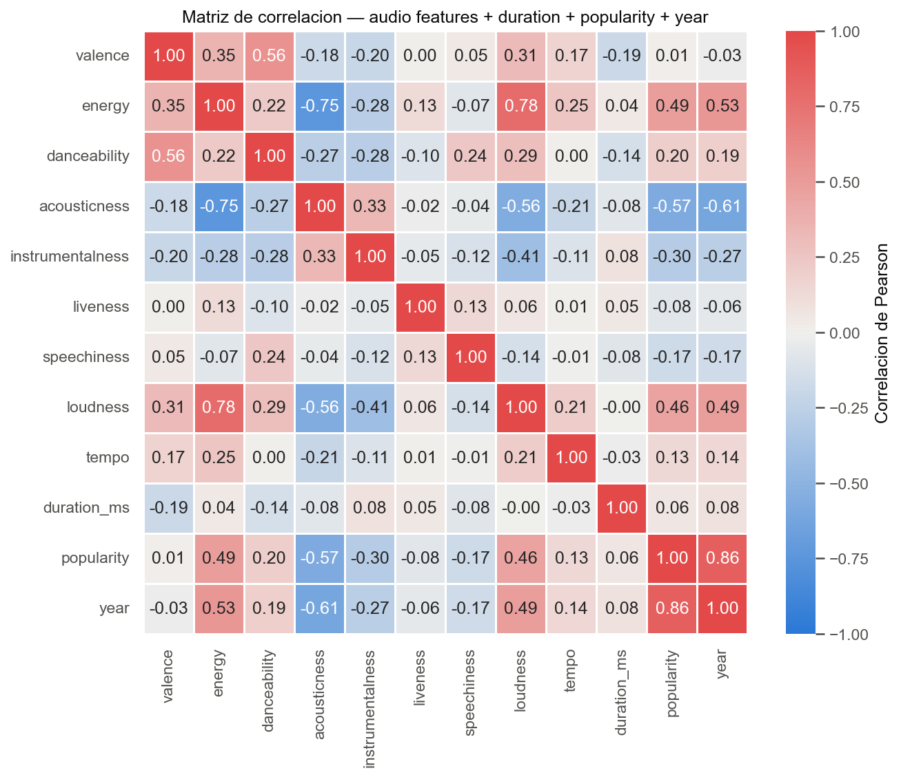</p>

### 3.5 Insight de negocio: la "paradoja de la popularidad"

`popularity` correlaciona **0.86 con `year`** — el algoritmo de Spotify pondera
reproducciones recientes, así que una canción de 1960 está estructuralmente en
desventaja frente a una de 2015 aunque sea igual de icónica en su época. **Comparar
popularidad absoluta entre décadas es engañoso.**

**Decisión de ingeniería:** se calcula `popularity_pct_in_year` = percentil de la
pista dentro de *su propio año* (`groupby("year").rank(pct=True)`). Esta columna es
la que alimenta el filtro "solo top 5% de su año" en la vista de proyección
(Task D), permitiendo comparar "qué tan hit fue" de forma justa entre épocas.

<p align="center">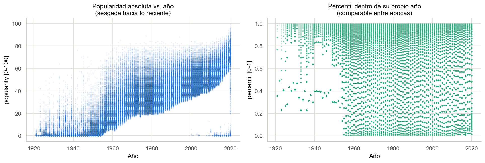</p>

### 3.6 Enriquecimiento: género por pista

`data.csv` no trae género; `data_w_genres.csv` trae género por **artista**. Se hizo
join por nombre exacto de artista (`main_artist`, primer artista de la lista de
colaboradores) → **10.3% de las pistas quedan sin género** (colaboraciones,
artistas sin catálogo de género en Spotify, variantes de casing). Se probó
normalizar casing (`.str.lower().str.strip()`) — no mejoró el join en este dataset
(los nombres ya vienen consistentes en mayúsculas/minúsculas), así que el 10.3% de
`unknown` se deja explícito en vez de inventar un género. Es una limitación
documentada, no oculta.

<p align="center">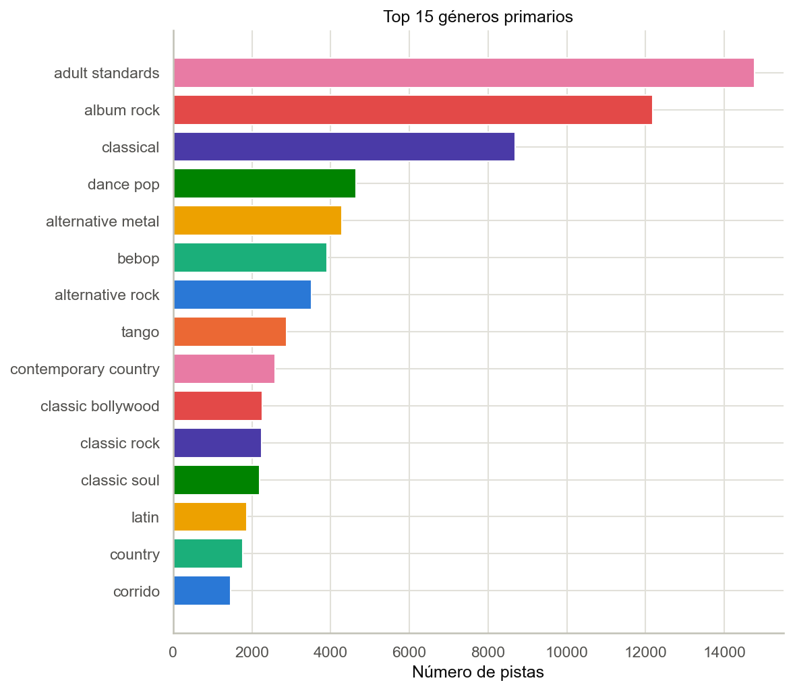</p>

### 3.7 Tendencias por década (evolución de la producción musical)

| Década | acousticness | loudness (dB) | energy | danceability |
|---|---|---|---|---|
| 1920s | 0.80 | -16.7 | 0.24 | 0.59 |
| 1960s | 0.62 | -12.7 | 0.42 | 0.50 |
| 2000s | 0.27 | -7.5 | 0.65 | 0.57 |
| 2020s | 0.22 | -6.6 | 0.63 | 0.69 |

`acousticness` cae sostenidamente (electrificación de la industria);
`loudness` sube ~10dB en un siglo (**"loudness war"** de masterización — confirmado
por `r(loudness, year) = 0.49`); `danceability` da su salto más grande en la
última década. Estos tres hechos son la base directa de **Task C**.

<p align="center">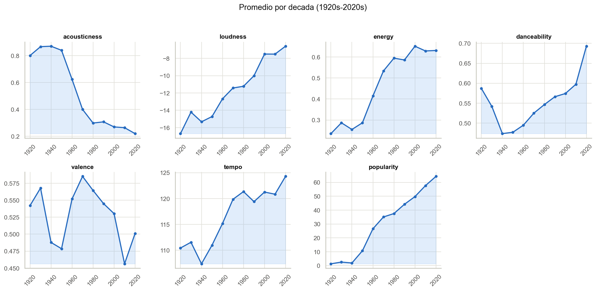</p>

### 3.8 Limpieza final aplicada (documentada, no agresiva)

1. `drop_duplicates(subset="id")` — 0 filas removidas (ya era único).
2. Descartar `duration_ms < 5000` — 0 filas (sanity check, no afectó este dataset).
3. Descartar `year` fuera de `[1900, 2026]` — 0 filas.
4. Género faltante → categoría explícita `"unknown"` (nunca se infiere/imputa un
   género inventado).
5. Se generan columnas `*_norm` (min-max) para 11 features continuas.
6. Export: `data/processed/tracks_clean.csv` (170,653 filas, dataset completo) y
   `data/processed/tracks_sample.csv` (muestra **estratificada por década**, 400
   pistas/década × 11 décadas ≈ 4,400 filas) — la app sirve la muestra para que
   RadViz/Star/Parallel respondan en tiempo real en SVG; el dataset completo queda
   disponible para agregados (`by_year.csv`, `by_genres.csv`).

---

## 4. Las 4 tareas analíticas (no genéricas, basadas en el EDA)

El enunciado pide ≥3 tareas y una visualización obligatoria de cada técnica. En vez
de usar el ejemplo literal del enunciado ("¿cómo se agrupan las pistas por
energy/valence/danceability?"), cada tarea aquí nace de un hallazgo específico del
EDA y está diseñada para esa técnica en particular — no es intercambiable.

### Task A · RadViz — "Firmas sonoras por género"
**Pregunta:** ¿Gravitan distintos géneros hacia distintas combinaciones de rasgos
de audio? ¿Qué anclajes "atraen" más a la música clásica vs. dance pop?
**Por qué RadViz:** el dimensional anchoring es ideal quan la pregunta es sobre
*combinaciones* de features (no una sola), y el color por género (paleta
categórica de 7 slots + "Other") deja ver de inmediato si un género forma una nube
compacta cerca de un anclaje (ej. clásica cerca de *acousticness*) o está disperso.
**Interacción propuesta:** click en un anclaje lo activa/desactiva (dimensional
anchoring) — mínimo 2 anclajes activos. *(pendiente de implementar, ver `radviz.js`)*

### Task B · Star Coordinates — "Detector de género-bender"
**Pregunta:** ¿Qué pistas suenan "raro" para el género que tienen declarado? (ej.
una balada acústica catalogada como "dance pop").
**Por qué Star Coordinates:** a diferencia de RadViz (que normaliza por la suma de
pesos), Star Coordinates permite **pesar y rotar ejes libremente**, lo que deja al
usuario "ampliar" ciertos rasgos para cazar anomalías. Se precalculó server-side
(`data_service.py`) la distancia euclidiana de cada pista al centroide normalizado
de su propio género — coloreable como capa alternativa (rampa secuencial aqua).
**Interacción propuesta:** arrastrar el extremo de cualquier eje para cambiar su
peso/ángulo (axis weighting + dragging); toggle de color género ↔
distancia-a-centroide. *(pendiente de implementar, ver `starcoords.js`)*

### Task C · Parallel Coordinates — "La guerra del volumen"
**Pregunta:** ¿cómo cambió la producción musical de 1921 a 2020? (hallazgo 3.7 del
EDA: acousticness↓, loudness↑, danceability↑ en la última década).
**Por qué Parallel Coordinates:** es la única técnica de las 4 donde brushear un
**rango continuo** (ej. años 2015-2020, o loudness > -6dB) y ver cómo se
redistribuyen *todos los demás ejes simultáneamente* — perfecto para una pregunta
sobre evolución conjunta de múltiples variables a través del tiempo.
**Interacción propuesta:** brushing (drag) en cualquiera de los ejes (sugerido:
incluir `year` como eje explícito, no solo color) para resaltar/atenuar el resto
de las líneas; color por década. *(pendiente de implementar, ver `parallel.js`)*

### Task D · Proyección (PCA / t-SNE) — "Línea de tiempo sonora y la paradoja de la popularidad"
**Pregunta 1:** ¿la música sigue una trayectoria sonora continua entre décadas, o
son épocas discretas y separadas? **Pregunta 2** (hallazgo 3.5): ¿los "hits" de
distintas épocas convergen hacia una misma región sonora pese a estar lejos en el
tiempo?
**Por qué PCA (proyección obligatoria):** reduce las 9 features de audio a 2D
preservando varianza global — permite dibujar una **trayectoria de centroides por
década** (línea 1920→2020) sobre la nube de puntos individuales, y superponer los
*loadings* (vectores de las features originales) como biplot. t-SNE está disponible
como alternativa (checkbox) para explorar estructura local no lineal en una muestra
fija de 1,500 pistas.
**Interacción propuesta:** toggle PCA/t-SNE, color por década o por percentil de
popularidad del año, checkbox "solo top 5% de su año" (aplica el hallazgo 3.5).
*(el endpoint `/api/projection` ya funciona; el dibujo en `projection.js` está pendiente)*

---

## 5. Arquitectura del pipeline

```
data/
  raw/                    ← CSVs originales (del zip, sin tocar)
  processed/              ← generados por eda/eda_report.py
    tracks_clean.csv      ← 170,653 filas, features *_norm, género enriquecido
    tracks_sample.csv     ← muestra estratificada por década (~4,400 filas, sirve la app)
    by_year.csv, by_genres.csv, genres_list.json
eda/
  eda_report.py           ← EDA tabular exhaustivo (12 secciones), genera data/processed/ (local, no versionado)
  eda_report.txt          ← log de salida de eda_report.py (local, no versionado)
  eda_notebook.ipynb      ← EDA visual (histogramas, boxplots, heatmap, barplots, series de tiempo)
  figures/                ← PNGs exportados del notebook (usados en este README)
app/
  app.py                  ← rutas Flask (HTML shell + API JSON) — completo
  data_service.py         ← carga datos, filtra, calcula PCA/t-SNE/centroides/anomaly score — completo
  templates/index.html    ← shell (4 tabs = 4 tasks, contenedores de filtros vacios)
  static/css/style.css    ← tokens de color light/dark + layout base (header, tabs, grid)
  static/js/
    utils.js               ← fetch + estado global de filtros (generico)
    radviz.js               ← Task A — TODO: dibujar RadViz
    starcoords.js           ← Task B — TODO: dibujar Star Coordinates
    parallel.js              ← Task C — TODO: dibujar Parallel Coordinates
    projection.js            ← Task D — TODO: dibujar proyeccion + trayectoria de centroides
    main.js                 ← orquestador minimo: carga inicial, tabs (filtros aun sin UI)
```

**Flujo de datos (ya funcional):** el navegador no necesita calcular PCA/t-SNE/
centroides — todo eso vive en `data_service.py` (pandas + scikit-learn) y se
expone como JSON delgado (`/api/tracks`, `/api/projection`, `/api/by_year`,
`/api/meta`). Lo que falta es que D3 consuma ese JSON y dibuje.

### Endpoints

| Ruta | Devuelve |
|---|---|
| `GET /api/meta` | géneros top-7+Other, features, rango de años/décadas |
| `GET /api/tracks?genres=&decade_min=&decade_max=` | pistas filtradas + `anomaly_score_norm` |
| `GET /api/projection?method=pca\|tsne&genres=&decade_min=&decade_max=` | coords 2D, varianza explicada, loadings, centroides por década |
| `GET /api/by_year` | agregados año a año (soporte para Task C) |
| `GET /api/genre_centroids` | centroide normalizado por género (usado internamente para el anomaly score) |

### Paleta y diseño (recomendación, no aplicada aún)

Para cuando se implementen las 4 vistas, conviene seguir el skill de dataviz
interno de este repo (`references/palette.md`): paleta categórica de 8 slots ya
validada (CVD ΔE ≥ 12, ordenamiento fijo — nunca reasignar un color al filtrar
géneros), rampa secuencial de un solo tono para década/popularidad, tokens
light/dark explícitos (no un invert automático), marcas ≥8px con halo de 2px del
color de superficie, hit-targets ampliados, y tooltip con `textContent` (no
`innerHTML`, para evitar XSS con nombres de artista/canción que vienen de datos
externos). `style.css` ya trae los tokens de color base (`:root` / `prefers-color-scheme: dark`).

---

## 6. Qué falta (estado real del pipeline)

**Hecho:** descompresión de datos, EDA tabular + notebook visual, limpieza y
enriquecimiento, API Flask completa (`/api/meta`, `/api/tracks`, `/api/projection`
con PCA/t-SNE, `/api/by_year`, `/api/genre_centroids`), shell HTML con las 4 tabs,
tokens de diseño base. Verificado con Playwright: el shell carga, las 4 pestañas
navegan y cada vista muestra su placeholder, sin errores de consola.

**Pendiente (a propósito, no implementado por diseño):**
- El dibujo en D3 de las 4 técnicas (`radviz.js`, `starcoords.js`, `parallel.js`,
  `projection.js` — cada uno con el contrato de datos y un `TODO` explicando qué
  construir).
- La UI de filtros globales (género/década) — los contenedores existen en el HTML
  y el backend ya acepta `?genres=&decade_min=&decade_max=`, falta la construcción
  de chips/slider en `main.js`.
- Interacciones (drag, brushing, tooltips, toggles) descritas como "interacción
  propuesta" en cada task de la sección 4.

## 7. Limitaciones conocidas del backend

- El join género↔pista pierde 10.3% de las filas (artistas sin género catalogado o
  colaboraciones); se deja como `"unknown"` en vez de imputar.
- La app sirve la muestra estratificada (4,400 filas) para que las futuras vistas
  SVG respondan en tiempo real; el dataset completo (170k) está procesado y
  disponible en `tracks_clean.csv` para análisis batch o para migrar a Canvas/WebGL
  si se necesita graficar el dataset completo punto por punto.
- t-SNE se computa sobre una submuestra fija de 1,500 pistas (costoso) y se
  cachea en memoria tras el primer request.
